<!-- README.md is generated from README.Rmd. Please edit that file -->

# countryatlas 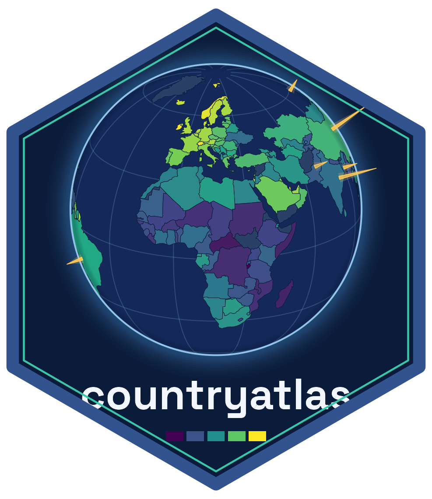

<!-- badges: start -->

[](https://CRAN.R-project.org/package=countryatlas)
[](https://github.com/PursuitOfDataScience/countryatlas/actions/workflows/R-CMD-check.yaml)
[](https://lifecycle.r-lib.org/articles/stages.html#stable)
<!-- badges: end -->

> **Country data onto honest maps — joined on ISO codes, never on country names.**

Join the World Bank's life-expectancy table to `map_data("world")` by country
name and **42 of 215 countries silently vanish**: nobody spells Czechia,
Côte d'Ivoire or `"Congo, Dem. Rep."` the same way twice. `countryatlas` makes
the ISO code the join key, so nothing goes missing — then draws the map.

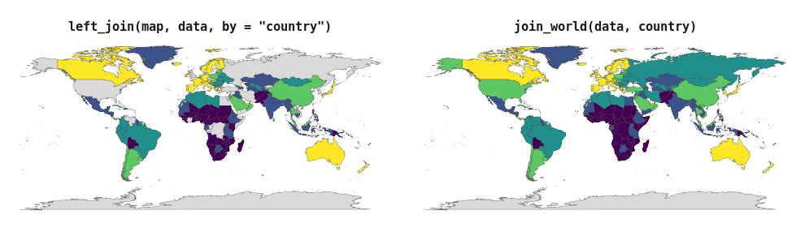

## Install

``` r
install.packages("countryatlas")                            # CRAN
pak::pak("PursuitOfDataScience/countryatlas")               # development
```

The base install is light. Every heavy spatial dependency (`sf`, `cartogram`,
`leaflet`, …) is a `Suggests` you only need for the feature that uses it.

## One call

`world_data()` fetches the indicator, attaches the geometry and keys the whole
thing on `iso3c` — three worlds (`ggplot2` maps, [WDI](https://github.com/vincentarelbundock/WDI), [countrycode](https://github.com/vincentarelbundock/countrycode))
stitched together in one line.

``` r
world_map(world_data(2020), gdp_per_capita, style = "quantile")
```

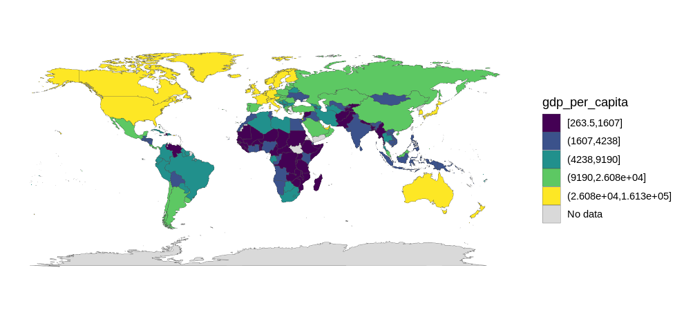

``` r
world_data(2020, c(life_exp = "SP.DYN.LE00.IN")) |>
  glimpse()
#> Rows: 99,338
#> Columns: 12
#> $ long      <dbl> -69.89912, -69.89571, -69.94219, -70.00415, -70.06612, -70.0…
#> $ lat       <dbl> 12.45200, 12.42300, 12.43853, 12.50049, 12.54697, 12.59707, …
#> $ group     <dbl> 1, 1, 1, 1, 1, 1, 1, 1, 1, 1, 2, 2, 2, 2, 2, 2, 2, 2, 2, 2, …
#> $ order     <int> 1, 2, 3, 4, 5, 6, 7, 8, 9, 10, 12, 13, 14, 15, 16, 17, 18, 1…
#> $ subregion <chr> NA, NA, NA, NA, NA, NA, NA, NA, NA, NA, NA, NA, NA, NA, NA, …
#> $ iso3c     <chr> "ABW", "ABW", "ABW", "ABW", "ABW", "ABW", "ABW", "ABW", "ABW…
#> $ iso2c     <chr> "AW", "AW", "AW", "AW", "AW", "AW", "AW", "AW", "AW", "AW", …
#> $ country   <chr> "Aruba", "Aruba", "Aruba", "Aruba", "Aruba", "Aruba", "Aruba…
#> $ continent <chr> "Americas", "Americas", "Americas", "Americas", "Americas", …
#> $ region    <chr> "Latin America & Caribbean", "Latin America & Caribbean", "L…
#> $ income    <fct> High income, High income, High income, High income, High inc…
#> $ life_exp  <dbl> 75.406, 75.406, 75.406, 75.406, 75.406, 75.406, 75.406, 75.4…
```

Geometry, codes, classifications and the indicator, in one frame, ready for
`world_map()`.

Drop `geometry` for a plain country table (`country_data()`), ask for a year
range to get a panel, or pass several indicators at once. `wdi_search()` finds
codes offline; `common_indicators` keeps the 20 you actually use.

## Your data, on the map

Point `join_world()` at whatever column holds the country and it standardises,
joins and attaches geometry in one go.

``` r
tibble(
  nation = c("U.S.", "S. Korea", "Czechia", "Kosovo", "Cote d'Ivoire", "Burma"),
  score  = c(10, 8, 6, 4, 7, 5)
) |>
  join_world(nation, warn = FALSE) |>
  world_map(score, title = "Six countries, six spellings, one map")
```

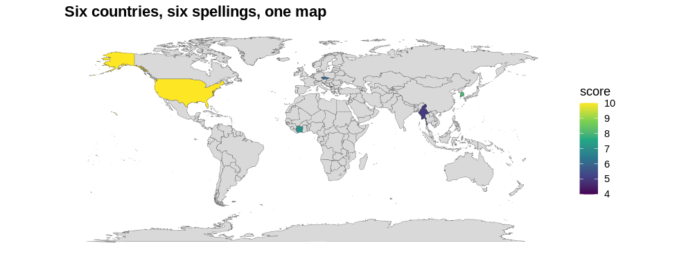

Two messy tables reconcile against each other the same way:

``` r
a <- tibble(country = c("Czechia", "South Korea"), gdp = c(1, 2))
b <- tibble(nation  = c("Czech Republic", "Korea, Rep."), pop = c(10, 51))
country_join(a, b, country, nation)
#> # A tibble: 2 × 5
#>   country       gdp iso3c nation           pop
#>   <chr>       <dbl> <chr> <chr>          <dbl>
#> 1 Czechia         1 CZE   Czech Republic    10
#> 2 South Korea     2 KOR   Korea, Rep.       51
```

## Nothing goes missing quietly

`check_country_match()` reports before you join — including the entities
`countrycode` resolves *wrongly* rather than not at all.

``` r
check_country_match(c("USA", "Cote d'Ivoire", "USSR", "Wakanda"))
#> # A tibble: 4 × 5
#>   input         iso3c matched historical suggestion
#>   <chr>         <chr> <lgl>   <lgl>      <chr>     
#> 1 USA           USA   TRUE    FALSE      <NA>      
#> 2 Cote d'Ivoire CIV   TRUE    FALSE      <NA>      
#> 3 USSR          RUS   TRUE    TRUE       <NA>      
#> 4 Wakanda       <NA>  FALSE   FALSE      Canada
```

`repair_country_names()` fixes typos, `audit_coverage()` grades a finished
join, and `dissolve_country()` expands a dead state into its successors.

``` r
dissolve_country("Yugoslavia")
#> # A tibble: 7 × 5
#>   input      historical dissolved iso3c country             
#>   <chr>      <chr>          <int> <chr> <chr>               
#> 1 Yugoslavia Yugoslavia      1992 BIH   Bosnia & Herzegovina
#> 2 Yugoslavia Yugoslavia      1992 HRV   Croatia             
#> 3 Yugoslavia Yugoslavia      1992 MKD   North Macedonia     
#> 4 Yugoslavia Yugoslavia      1992 MNE   Montenegro          
#> 5 Yugoslavia Yugoslavia      1992 SRB   Serbia              
#> 6 Yugoslavia Yugoslavia      1992 SVN   Slovenia            
#> 7 Yugoslavia Yugoslavia      1992 XKX   Kosovo
```

## The gallery

Every map below is one function call on the bundled offline snapshot.

<table>
<tr>
<td width="50%">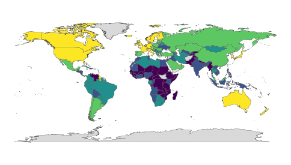<br><sub><code>world_map(d, gdp_per_capita, style = "quantile")</code></sub></td>
<td width="50%">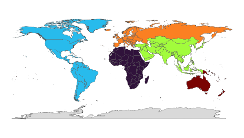<br><sub><code>world_map(d, continent, style = "categorical")</code></sub></td>
</tr>
<tr>
<td>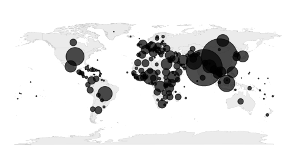<br><sub><code>bubble_map(d, population)</code></sub></td>
<td>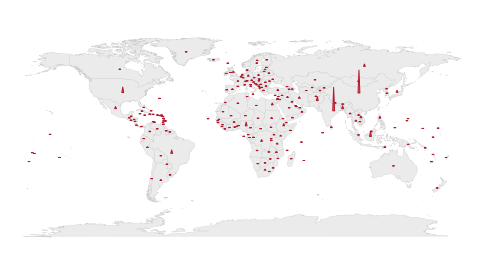<br><sub><code>spike_map(d, population)</code></sub></td>
</tr>
<tr>
<td>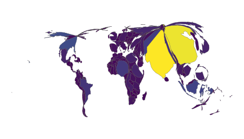<br><sub><code>cartogram_map(d, population)</code></sub></td>
<td>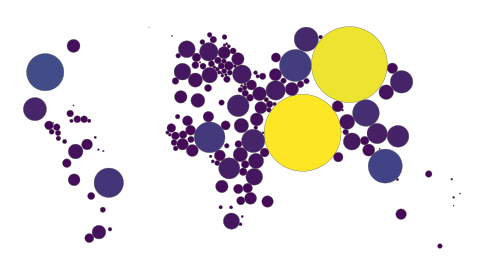<br><sub><code>dorling_map(d, population)</code></sub></td>
</tr>
<tr>
<td>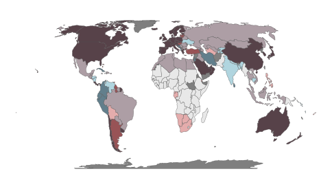<br><sub><code>bivariate_map(d, gdp_per_capita, life_expectancy)</code></sub></td>
<td>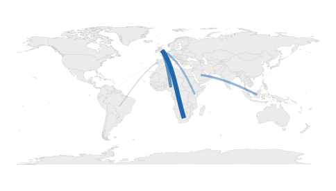<br><sub><code>flow_map(corridors, from, to, people)</code></sub></td>
</tr>
<tr>
<td>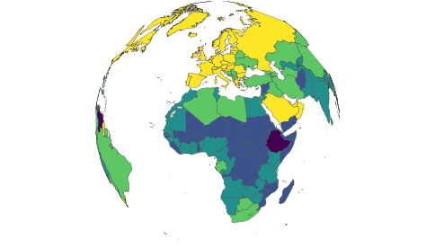<br><sub><code>globe_map(d, income, style = "categorical")</code></sub></td>
<td align="center">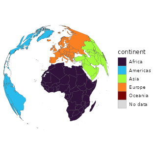<br><sub><code>spin_globe(d, continent, style = "categorical")</code></sub></td>
</tr>
<tr>
<td colspan="2">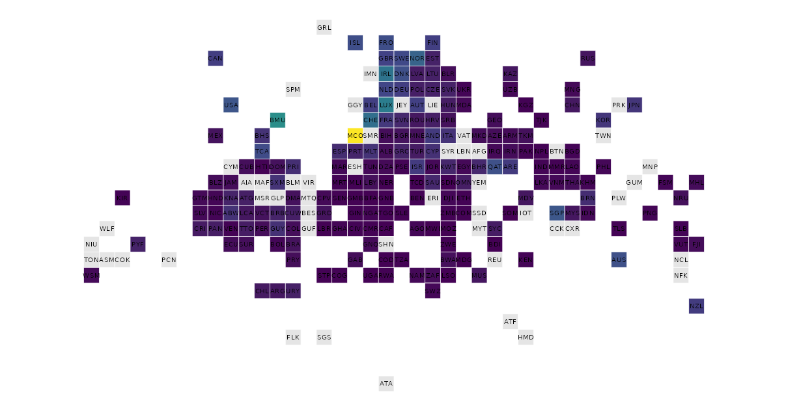<br><sub><code>tile_map(d, gdp_per_capita)</code> — one square per country, so microstates are as visible as Russia</sub></td>
</tr>
<tr>
<td colspan="2">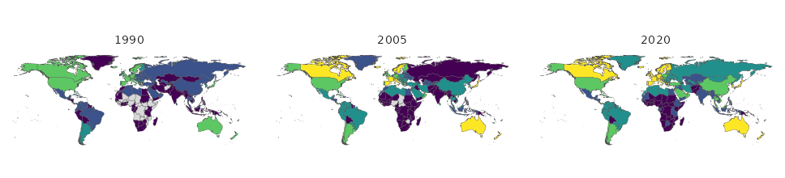<br><sub><code>facet_map(panel, life_exp, year, style = "quantile")</code> — or <code>animate_world(panel, life_exp)</code> for the moving version</sub></td>
</tr>
</table>

`interactive_map()` hands the same frame to **plotly**, **ggiraph**,
**leaflet** or **ggsql** for a web-ready widget. With `as_ggsql_source()` and
`world_query()` the drawing happens *inside DuckDB* — countryatlas reconciles
the countries, [ggsql](https://ggsql.org) renders them without ggplot2 or `sf` at runtime.

## Honest by construction

"Honest maps" is in the package description, so the package has to earn it.
Four ways a world map misleads, the verb for each — and one more that makes the
map admit what it did.

**Your classification is doing the talking.** Equal-interval breaks put 92% of
countries in one class here; quantiles spread them evenly. Same data, same
palette, opposite conclusions.

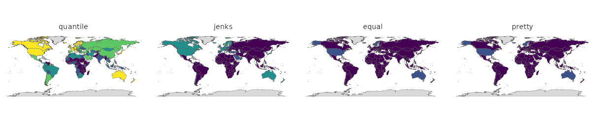

``` r
p <- classify_compare(poly, gdp_per_capita)
attr(p, "countryatlas_classification") |> filter(method %in% c("quantile", "equal"))
#> # A tibble: 10 × 4
#>    method   class                     n   share
#>    <chr>    <chr>                 <int>   <dbl>
#>  1 quantile [268.7,1662]             38 0.201  
#>  2 quantile (1662,4594]              38 0.201  
#>  3 quantile (4594,1.029e+04]         37 0.196  
#>  4 quantile (1.029e+04,2.937e+04]    38 0.201  
#>  5 quantile (2.937e+04,2.472e+05]    38 0.201  
#>  6 equal    [268.7,4.965e+04]       173 0.915  
#>  7 equal    (4.965e+04,9.903e+04]    13 0.0688 
#>  8 equal    (9.903e+04,1.484e+05]     2 0.0106 
#>  9 equal    (1.484e+05,1.978e+05]     0 0      
#> 10 equal    (1.978e+05,2.472e+05]     1 0.00529
```

**Your projection is doing the talking too.** Tissot's indicatrix puts circles
of equal ground radius on the map: whatever the projection does to them, it is
doing to your data.

<table>
<tr>
<td width="50%">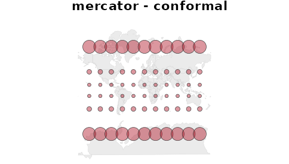<br><sub><code>tissot_map("mercator")</code> — shapes right, areas wildly wrong</sub></td>
<td width="50%">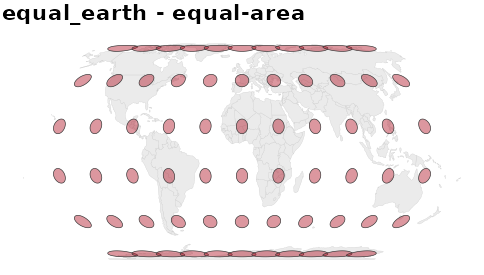<br><sub><code>tissot_map("equal_earth")</code> — areas right, shapes sheared</sub></td>
</tr>
<tr>
<td colspan="2">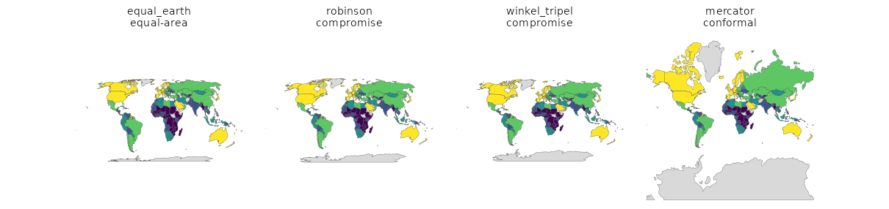<br><sub><code>projection_compare(d, gdp_per_capita)</code> — and <code>projection_info()</code> for which of the thirteen are equal-area</sub></td>
</tr>
</table>

**Grey means "no data", but it reads as "low".** Hatch the gaps so nobody
mistakes them for a value, or map availability itself.

<table>
<tr>
<td width="50%">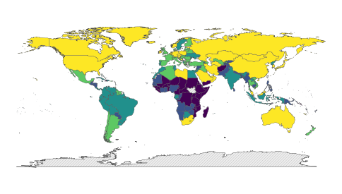<br><sub><code>world_map(d, co2_per_capita, na_style = "hatched")</code></sub></td>
<td width="50%">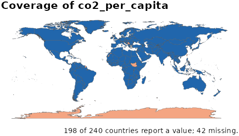<br><sub><code>coverage_map(d, co2_per_capita)</code></sub></td>
</tr>
</table>

**A rate over eleven thousand people should not shout as loudly as one over a
billion.** Value-by-alpha spends opacity on the denominator, so small-population
countries recede — the cartogram's answer to the same problem, without
distorting the geometry.

<p align="center">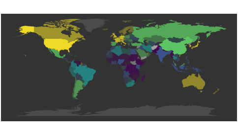</p>

``` r
value_by_alpha_map(d, gdp_per_capita, population)
```

**And the map should say what it is.** `footnote = "auto"` writes the coverage
line; `map_provenance()` answers the questions a reviewer asks first.

``` r
world_map(poly, gdp_per_capita, style = "quantile",
          na_style = "hatched", footnote = "auto") |>
  map_provenance()
#> 
#> ── countryatlas map provenance
#> package: countryatlas 3.0.0 (snapshot 2024)
#> fill: gdp_per_capita
#> geometry: polygon backend, coord_quickmap
#> classification: quantile, 5 bins
#> missing data: hatched
#> coverage: 189 countries shown, 51 missing
#> breaks: 268.7 | 1662 | 4594 | 10290 | 29370 | 247200
```

## Other sources, other years, other levels

The ISO spine is not only the World Bank's, and not only 2024's.

<table>
<tr>
<td width="50%">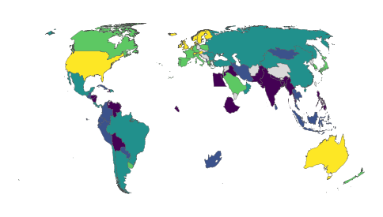<br><sub><code>attach_geometry(d, year = 1950)</code> — 1950 borders, via CShapes. Africa is nearly empty because in 1950 almost none of it was sovereign; pass <code>dependencies = TRUE</code> for the colonies.</sub></td>
<td width="50%">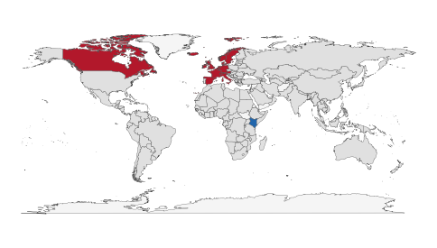<br><sub><code>lisa_map(d, gdp_per_capita, weights = country_weights("knn"))</code></sub></td>
</tr>
<tr>
<td>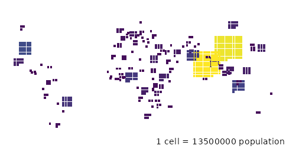<br><sub><code>gridded_cartogram(d, population)</code> — one cell per N people, countable</sub></td>
<td><br><sub><code>value_by_alpha_map(d, gdp_per_capita, population)</code></sub></td>
</tr>
<tr>
<td colspan="2">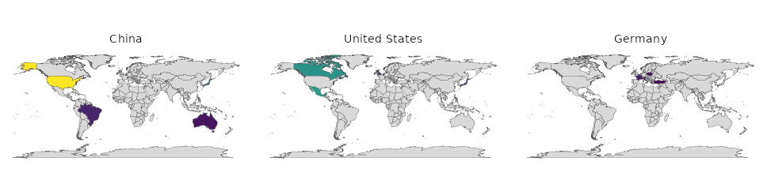<br><sub><code>od_map(flows, from, to, value)</code> — where each origin sends, when <code>flow_map()</code> would be spaghetti</sub></td>
</tr>
</table>

**Membership is a function of time**, and a snapshot quietly misstates any panel
that spans an accession:

``` r
c(`2016` = in_group("United Kingdom", "EU", as_of = 2016),
  `2021` = in_group("United Kingdom", "EU", as_of = 2021))
#>  2016  2021 
#>  TRUE FALSE
```

**Islands have no land border**, so the default contiguity weights drop a
quarter of the world from a "global" Moran's I. `country_weights()` fixes it,
and the result says how many it dropped either way:

``` r
snap <- world_snapshot$countries
cols <- c("i", "n", "n_excluded")
rbind(
  cbind(scheme = "contiguity",
        morans_i(snap, gdp_per_capita, n_perm = 0)[cols]),
  cbind(scheme = "knn",
        morans_i(snap, gdp_per_capita, n_perm = 0,
                 weights = country_weights("knn", k = 5))[cols])
)
#>       scheme         i   n n_excluded
#> 1 contiguity 0.6073182 142         49
#> 2        knn 0.4720522 189          2
```

**Any provider, one shape.** `register_country_source()` takes a fetch function
and a name; `fetch_indicator()` and `compare_sources()` do the rest — including
telling you where two providers disagree.

``` r
country_sources()[, c("source", "meta")]
#> # A tibble: 5 × 2
#>   source   meta                                                          
#>   <chr>    <chr>                                                         
#> 1 comtrade UN Comtrade bilateral trade (via comtradr); needs an API token
#> 2 eurostat Eurostat (via eurostat); European coverage only               
#> 3 oecd     OECD statistics (via OECD)                                    
#> 4 owid     Our World in Data (via owidR)                                 
#> 5 wdi      World Bank World Development Indicators (via WDI)
```

## Beyond the map

``` r
snap <- world_snapshot$countries

# inequality between people, not between country units
gini(snap$gdp_per_capita, weights = snap$population)
#> [1] 0.6094909

# how much of it sits between continents rather than within them
theil(snap$gdp_per_capita, weights = snap$population, groups = snap$continent)
#> # A tibble: 3 × 3
#>   component value share
#>   <chr>     <dbl> <dbl>
#> 1 total     0.678 1    
#> 2 between   0.310 0.458
#> 3 within    0.368 0.542

# who borders whom, and how far apart they are -- no sf required
distance_between("France", "Germany")
#> [1] 802.3524
convert_country(c("Japan", "Brazil"), to = "flag")
#> [1] "🇯🇵" "🇧🇷"
```

|  |  |
|----|----|
| **Assemble** | `world_data()` `country_data()` `world_geometry()` `attach_geometry()` `clear_country_cache()` |
| **Other sources** | `register_country_source()` `country_sources()` `fetch_indicator()` `add_indicator()` `compare_sources()` `fetch_owid()` `fetch_eurostat()` `fetch_oecd()` `fetch_comtrade()` |
| **Join** | `standardize_country()` `join_world()` `country_join()` `country_join_all()` `dissolve_country()` `standardize_subnational()` |
| **Diagnose** | `check_country_match()` `repair_country_names()` `audit_coverage()` `audit_time_coverage()` `rate_check()` `check_dispute_coverage()` `country_overrides()` |
| **Look up** | `convert_country()` `country_codes()` `country_groups()` `in_group()` `wdi_search()` |
| **Compute** | `per_capita()` `share_of_world()` `growth_rate()` `index_to()` `rank_countries()` `aggregate_regions()` `complete_years()` `lag_by_country()` `diff_by_country()` `correlate_indicators()` `deflate()` `to_ppp()` `smooth_rates()` `interpolate_missing()` |
| **Measure spread** | `gini()` `theil()` `beta_convergence()` `sigma_convergence()` `convergence_club()` |
| **Spatial statistics** | `country_weights()` `morans_i()` `local_morans()` `lisa_map()` `gearys_c()` `getis_ord()` `spatial_lag()` |
| **Locate** | `locate_country()` `neighbors()` `country_borders()` `distance_between()` `simplify_geometry()` `nuts_geometry()` |
| **Travel in time** | `historical_geometry()` `country_timeline()` `country_groups(as_of=)` `in_group(as_of=)` |
| **Relate** | `flow_matrix()` `country_network()` `od_map()` |
| **Draw** | `world_map()` `globe_map()` `spin_globe()` `facet_map()` `bubble_map()` `spike_map()` `bivariate_map()` `cartogram_map()` `dorling_map()` `value_by_alpha_map()` `tile_map()` `flow_map()` `animate_world()` `interactive_map()` `gridded_cartogram()` `subnational_map()` `geom_country_labels()` `theme_world_map()` |
| **Keep honest** | `classify_compare()` `coverage_map()` `projection_info()` `projection_compare()` `projection_distortion()` `tissot_map()` `cartogram_diagnostics()` `map_provenance()` `dispute_policy()` |
| **Report** | `country_factsheet()` `world_table()` |
| **Push to the database** | `as_ggsql_source()` `world_query()` |
| **Bundled data** | `world_snapshot` `country_meta` `common_indicators` `country_groups_tbl` `country_groups_history` `disputed_territories` `world_tiles` `historical_codes` |

## Offline by default

`world_snapshot` ships a curated indicator set for one recent year, so every
example, test and vignette in the package runs with the network unplugged.
Live `world_data()` calls are memoised on disk between sessions.

<details>
<summary><b>Which optional package does what</b></summary>

| Needs | For |
|----|----|
| `maps` | the polygon backend: `world_map()`, `bubble_map()`, `spike_map()`, `flow_map()`, `globe_map(backend = "polygon")` (with `mapproj`) |
| `sf` + `rnaturalearth` + `rnaturalearthdata` | real geometry: `world_map(sf)`, `world_geometry(sf)`, `locate_country()`, `country_borders()`, `neighbors()`, `morans_i()` |
| `cartogram` + `sf` | `cartogram_map()`, `dorling_map()` |
| `biscale` + `sf` | `bivariate_map()` |
| `gganimate` + `gifski` or `magick` | `animate_world()`, `spin_globe()` |
| `cartogramR` | `cartogram_map(type = "flow")`, the fast Gastner-Seguy-More algorithm |
| `cshapes` | `historical_geometry()` and `attach_geometry(year=)` |
| `owidR` / `eurostat` / `OECD` / `comtradr` | the four built-in `fetch_*()` source adapters |
| `mapgl` | `interactive_map(engine = "mapgl")`, `globe_map(interactive = TRUE)` |
| `tmap` | `world_map(engine = "tmap")` |
| `giscoR` / `regions` | `nuts_geometry()`, `standardize_subnational()` |
| `gt` | `world_table()` |
| `ggpattern` | `world_map(na_style = "hatched")` |
| `plotly` / `ggiraph` / `leaflet` / `ggsql` | the four `interactive_map()` engines |
| `duckdb` + `DBI`, or `nanoarrow` | `as_ggsql_source()` |
| `stringdist` | fuzzy matching in `repair_country_names()` and `check_country_match()` |
| `rmapshaper` | the better simplifier behind `simplify_geometry()` |
| `classInt` | `style = "jenks"` |

</details>

## Learn more

[Getting started](https://pursuitofdatascience.github.io/countryatlas/articles/getting-started.html) · [Joining your own data](https://pursuitofdatascience.github.io/countryatlas/articles/joining-your-own-data.html) ·
[Maps with sf & projections](https://pursuitofdatascience.github.io/countryatlas/articles/sf-and-projections.html) · [Beyond the choropleth](https://pursuitofdatascience.github.io/countryatlas/articles/beyond-the-choropleth.html) ·
[countryatlas and ggsql](https://pursuitofdatascience.github.io/countryatlas/articles/countryatlas-and-ggsql.html) · [Full reference](https://pursuitofdatascience.github.io/countryatlas/) · [Changelog](NEWS.md)
