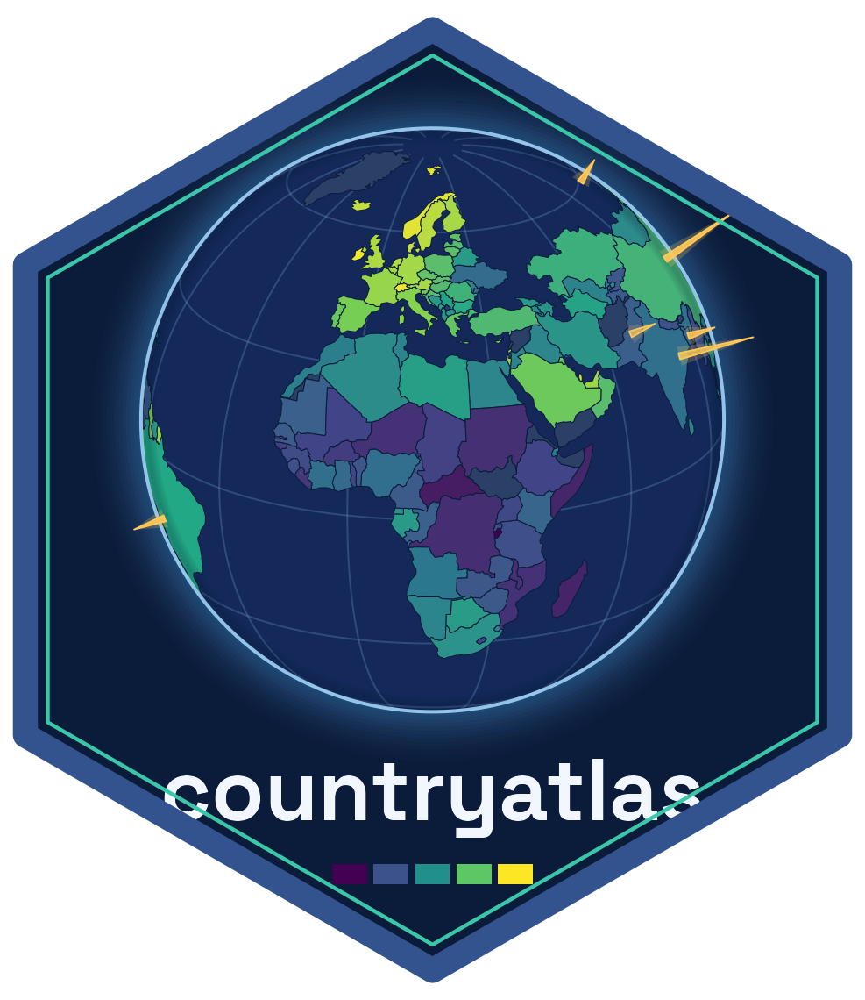
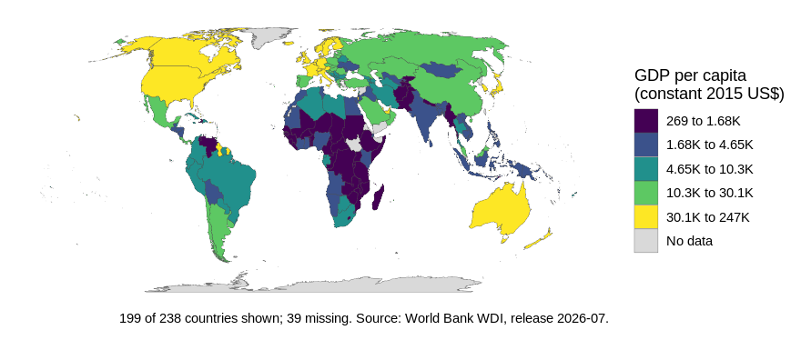

<!-- README.md is generated from README.Rmd. Please edit that file -->

# countryatlas 

<!-- badges: start -->

[](https://CRAN.R-project.org/package=countryatlas)
[](https://github.com/PursuitOfDataScience/countryatlas/actions/workflows/R-CMD-check.yaml)
<!-- badges: end -->

> **Country data onto honest maps: joined on ISO codes, never on country
> names.**

🔑 Messy names in, one key out, in any of a dozen languages:

``` r
library(countryatlas)
d <- data.frame(country = c("Cote d'Ivoire", "Korea, Rep.", "Deutschland", "U.K."))
standardize_country(d, country, add = "iso3c")
#> # A tibble: 4 × 2
#>   country       iso3c
#>   <chr>         <chr>
#> 1 Cote d'Ivoire CIV  
#> 2 Korea, Rep.   KOR  
#> 3 Deutschland   DEU  
#> 4 U.K.          GBR
```

🗺️ An equal-area map that states its coverage and its source:

``` r
world_map(attach_geometry(world_snapshot$countries), gdp_per_capita)
```



🕰️ Membership and classification as they were, not as they are:

``` r
in_group(c("GBR", "GBR"), "EU", origin = "iso3c", as_of = c(2016, 2021))
#> [1]  TRUE FALSE
classify_countries(data.frame(iso3c = "VNM", year = c(2026, 2027)), "income")
#>   iso3c year              income
#> 1   VNM 2026 Lower middle income
#> 2   VNM 2027 Upper middle income
```

## 🚀 Setup

1.  `install.packages("countryatlas")`
2.  `library(countryatlas)`: the bundled `world_snapshot` and the maps
    work offline.
3.  Optional, for the `sf` backend and every projection:
    `install.packages(c("sf", "rnaturalearth", "rnaturalearthdata"))`
4.  Live data: `world_data(2020)` from the World Bank, or any provider
    in `country_sources()` through `fetch_indicator()`.

## ⚠️ Gotchas

| What bites | What to do |
|:---|:---|
| Fetching needs the network | `world_snapshot` is offline; the fetchers call the providers. |
| World Bank releases revise old values | Pin one: `world_data(2020, vintage = "2024-07")`. |
| The cache lives in `tools::R_user_dir("countryatlas", "cache")` | `clear_country_cache()` empties it. |
| TLS errors behind a proxy | Point `CURL_CA_BUNDLE` at your CA bundle; never turn verification off. |
| `sf` will not load | Maps still draw: the polygon backend and its Equal Earth are built in. |

## 📚 Learn more

The
[Gallery](https://pursuitofdatascience.github.io/countryatlas/articles/gallery.html)
shows every map verb; the articles cover
[panels](https://pursuitofdatascience.github.io/countryatlas/articles/panels.html),
[tracing data to its
source](https://pursuitofdatascience.github.io/countryatlas/articles/data-you-can-trace.html)
and [honest
maps](https://pursuitofdatascience.github.io/countryatlas/articles/honest-maps.html).
